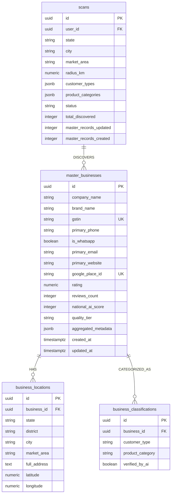

# Master Database Architecture & Data Specification

## Project: National IT Hardware Customer Intelligence Platform

---

## 1. Entity-Relationship Diagram

---

## 2. Table Specifications

### `master_businesses`
Single source of truth table for every IT hardware business entity in India.

- Primary Indexes: `idx_mb_primary_phone`, `idx_mb_company_name`, `idx_mb_google_place_id`, `idx_mb_gstin`.
- Triggers: Auto-update `updated_at` timestamp.

### `business_locations`
Spatial geography and bounding box location records linked 1-to-many with master businesses.

### `business_classifications`
Vertical classification tags (IT Distributors, System Integrators, Retailers, Product Categories).

### `scans`
Audit logs of national geographic scans and discovery execution stats.

---

## 3. Migration Files
- `schema.sql` — Legacy V1 baseline schema.
- `schema_v2.sql` — Master Customer Record V2 relational migration script.
